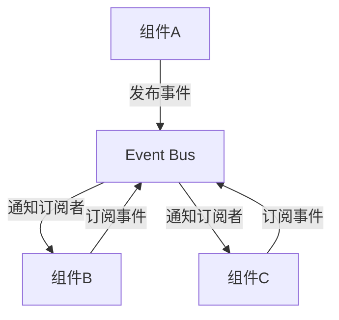
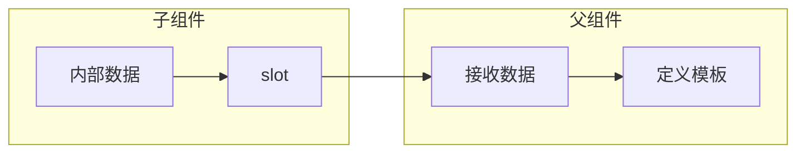
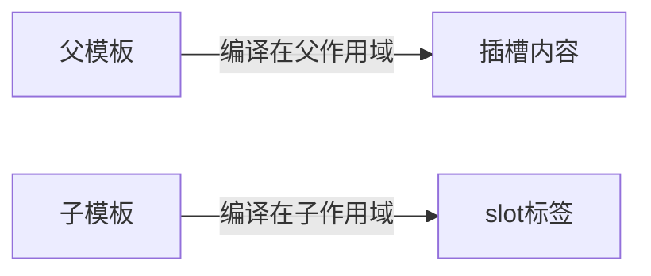

**组件通信是什么？**
在Vue的组件化架构中，**组件通信**指不同组件之间的数据传递与行为协调机制。当组件无法独立完成功能时，需通过特定API实现：

- 数据流：父组件向子组件传递状态（如`props`）
- 行为触发：子组件通知父组件执行操作（如`$emit`）
- 跨层级交互：无直接关系的组件交换信息（如`Event Bus`）


常见的组件间通信方式有 props、自定义事件、事件总线、插槽。

下边将一一介绍具体用法和使用场景


# props

## 一、Props 机制：单向数据流管道

**本质**：父组件向子组件传递数据的**只读通道**
**设计原则**：遵循 React 的「单向数据流」思想，保证数据可追踪性

------

## 二、基础用法（代码示例）

#### 父组件：传递数据

```vue
<template>
  <!-- 动态传值 -->
  <ChildComponent :title="pageTitle" :items="listData" />
  
  <!-- 静态传值 -->
  <ChildComponent status="published" />
</template>
```

#### 子组件：声明与接收

```javascript
export default {
  props: {
    // 基础类型验证
    status: {
      type: String,
      required: true,
      validator: value => ['draft', 'published'].includes(value)
    },
    
    // 复杂类型 + 默认值
    items: {
      type: Array,
      default: () => [] // 必须用工厂函数返回引用类型
    },
    
    // 简写（仅类型）
    title: String
  }
}
```

------

## 三、核心技术特征

1. **单向数据流**

   - 数据只能从父组件流向子组件
   - 禁止子组件直接修改 prop（控制台警告）

   ```javascript
   // 错误！违反单向数据流
   this.title = 'new title' 
   
   // 正确做法：通过事件通知父组件修改
   this.$emit('update-title', 'new title')
   ```

2. **Prop 命名规范**

   - HTML 中必须使用 **kebab-case**（短横线命名）

   ```vue
   <!-- 父组件模板 -->
   <child-component :user-name="currentUser" />
   ```

   - JS 中使用 **camelCase**（驼峰命名）

   ```javascript
   props: {
     userName: String // 子组件内使用驼峰
   }
   ```

3. **动态类型转换**

   - 非字符串类型需用 `v-bind` 动态绑定

   ```vue
   <!-- 传递数字 -->
   <child :count="42" />  <!-- 正确：数字 42 -->
   <child count="42" />   <!-- 错误：字符串 '42' -->
   ```

------

## 四、高级用法

### 1. 对象批量传递

```vue
<Child v-bind="userData" />

<!-- 等价于 -->
<Child :name="userData.name" :age="userData.age" />
```

### 2. 继承属性透传

非 props 的 attribute 将自动挂载到子组件根元素

```vue
<Child class="mt-4" /> <!-- class 会合并到子组件根节点 -->
```

禁用透传：设置 `inheritAttrs: false`

------

## 五、使用中注意事项

1. **引用类型陷阱**
   默认值需用工厂函数返回**新对象**，避免多组件共享同一引用

   ```javascript
   // 危险！所有实例共享同一数组
   default: []
   
   // 安全
   default: () => []
   ```

2. **性能优化**
   大对象 props 建议拆解为基本类型，减少不必要渲染

   ```vue
   <!-- 低效 -->
   <Child :data="largeObject" />
   
   <!-- 高效 -->
   <Child 
     :id="largeObject.id"
     :name="largeObject.name"
   />
   ```

3. **Prop 更新监控**
   子组件监听 prop 变化执行操作

   ```javascript
   export default {
     props: ['userId'],
     watch: {
       userId(newVal) {
         this.loadUserData(newVal) // 响应父组件传入值的变化
       }
     }
   }
   ```

------

## 六、适用场景判断

| 场景类型           | 是否推荐 | 理由                   |
| :----------------- | :------- | :--------------------- |
| 父→子传递初始配置  | ✅ 推荐   | 符合单向数据流设计     |
| 子组件修改父级状态 | ⚠️ 禁止   | 破坏数据流可预测性     |
| 传递复杂嵌套对象   | ⚠️ 谨慎   | 可能引发深层响应性问题 |
| 高频更新的数据     | ❌ 避免   | 易导致性能瓶颈         |

------

## 七、典型代码缺陷示例

```javascript
// 反模式 1：直接修改 prop 值
props: ['value'],
methods: {
  reset() {
    this.value = '' // 错误！Vue 将抛出警告
  }
}

// 反模式 2：对象默认值共享
props: {
  config: {
    type: Object,
    default: {} // 所有组件实例共享同一对象！
  }
}
```

> **设计箴言**：Props 是组件间的**输入参数**而非共享状态，保持其纯函数特性是架构清晰的关键。

------

### 附：Props 与 Data 的边界划分

| 特性         | Props         | Data         |
| :----------- | :------------ | :----------- |
| **数据源**   | 外部传入      | 内部生成     |
| **可变性**   | 不可直接修改  | 可自由修改   |
| **初始化**   | 父组件设置    | 组件内部定义 |
| **适用场景** | 配置/初始状态 | 交互状态     |


# 自定义事件

子→父通信的标准化协议

**本质**：子组件向父组件发送消息的**发布-订阅模型**
**设计原则**：反向数据流遵循「开闭原则」，父组件无需知晓子组件实现细节

## 一、基础使用模式

### 子组件：触发事件

```javascript
export default {
  methods: {
    submitForm() {
      // 标准写法（推荐）
      this.$emit('form-submit', {
        username: this.username,
        isValid: this.validateForm()
      })

      // 无载荷写法
      this.$emit('cancel')
    }
  }
}
```

### 父组件：监听处理

```vue
<template>
  <ChildComponent 
    @form-submit="handleSubmit"
    @cancel="isEditing = false"
  />
</template>

<script>
export default {
  methods: {
    // 接收事件载荷
    handleSubmit(payload) {
      console.log('收到数据:', payload)
      this.saveData(payload)
    }
  }
}
</script>
```

------

## 二、高级特性解析

#### 1. `.sync` 修饰符（Vue2.3+）

实现 prop 的「双向绑定」语法糖

```vue
<!-- 父组件 -->
<Child :title.sync="pageTitle" />

<!-- 等价于 -->
<Child 
  :title="pageTitle"
  @update:title="pageTitle = $event"
/>

<!-- 子组件触发 -->
this.$emit('update:title', '新标题')
```

#### 2. 自定义 `v-model`

替代默认的 `value` + `input` 行为

```vue
<!-- 父组件 -->
<CustomInput v-model="searchText" />

<!-- 子组件实现 -->
<script>
export default {
  model: {
    prop: 'keyword',   // 绑定的prop名
    event: 'search'    // 自定义事件名
  },
  props: ['keyword'],
  methods: {
    onInput(e) {
      this.$emit('search', e.target.value)
    }
  }
}
</script>
```

------

## 三、事件绑定与解绑

### 1. 绑定自定义事件

1. 第一种方式，在父组件中：`<Demo @internal-event="handleInternal"/>` 或 `<Demo v-on:internal-event="handleInternal"/>`

2. 第二种方式，在父组件中：

   ``` vue
   <Demo ref="demo"/>
   ......
   mounted(){
      this.$refs.xxx.$on('internal-event',this.handleInternal)
   }
   ```

   

### 2. 解绑自定义事件

`this.$off('atguigu')`


------

### 四、与 Props 的协作模式

| 场景                   | 通信方式      | 代码示例                       |
| :--------------------- | :------------ | :----------------------------- |
| **初始数据传递**       | Props         | `<Child :init-value="100" />`  |
| **子组件状态变更通知** | 自定义事件    | `@change="handleChange"`       |
| **父组件主动重置状态** | Props + Watch | `watch: { resetFlag() {...} }` |

> **黄金法则**：
> Props 向下流动 → 父组件控制子组件初始状态
> 事件向上流动 → 子组件通知父组件状态变更

------

### 五、常见陷阱与解决方案

#### 1. 事件丢失问题

```javascript
// 错误：异步回调中直接使用 $emit
setTimeout(() => {
  this.$emit('async-event') // this 可能已销毁
}, 1000)

// 正确：检查组件实例
setTimeout(() => {
  if (this._isMounted) { 
    this.$emit('async-event')
  }
}, 1000)
```

#### 2. 事件冲突

```javascript
// 场景：混用第三方组件事件
<ThirdPartyComponent @click="handleClick" />

// 方案：添加命名空间前缀
this.$emit('custom-click') // 避免覆盖原生事件
```

#### 3. 深层传递优化

```javascript
// 避免：事件链式传递（祖父-父-子）
GrandParent → Parent (@event) → Child (@event)

// 改用：Event Bus 或 Vuex
```

<hr/>

组件上也可以绑定原生DOM事件，需要使用`native`修饰符。

注意：通过`this.$refs.xxx.$on('atguigu',回调)`绑定自定义事件时，回调要么配置在methods中，要么用箭头函数，**否则this指向会出问题！**

------

### 六、适用场景评估

| 场景类型        | 推荐度 | 替代方案               |
| :-------------- | :----- | :--------------------- |
| 表单提交        | ✅ 首选 | 无                     |
| 模态框开/闭控制 | ✅ 首选 | .sync 修饰符           |
| 组件状态重置    | ⚠️ 谨慎 | 通过 prop 传递重置标志 |
| 跨多级组件通信  | ❌ 避免 | provide/inject         |

> **设计箴言**：自定义事件是 Vue 的「回调函数升级版」，通过标准化事件名和载荷格式，实现父子组件的解耦协作。


# 事件总线 (Event Bus)：全局事件中枢

**本质**：基于 Vue 实例实现的 **发布-订阅模式**，用于任意组件间通信
**定位**：轻量级全局通信方案，替代深层组件事件传递

## 核心架构图解



## 一、基础实现方案

### 1. 安装全局事件总线

``` javascript
new Vue({
	......
	beforeCreate() {
		Vue.prototype.$bus = this //安装全局事件总线，$bus就是当前应用的vm
	},
    ......
}) 
```

### 2. 使用事件总线

接收数据：A组件想接收数据，则在A组件中给$bus绑定自定义事件，事件的回调留在A组件自身。

``` js
methods(){
  demo(data){......}
}
......
mounted() {
  this.$bus.$on('xxxx',this.demo)
}
```

### 3. 提供数据

this.$bus.$emit('xxxx',数据)

<hr/>

**最好在beforeDestroy钩子中，用$off去解绑当前组件所用到的事件。**

## 二、与 Vuex 的适用场景对比

| 特性         | 事件总线            | Vuex                  |
| :----------- | :------------------ | :-------------------- |
| **通信方向** | 任意方向            | 集中式状态管理        |
| **数据存储** | 无状态              | 有状态存储            |
| **调试能力** | 困难（需手动日志）  | Devtools 完整支持     |
| **代码组织** | 分散在各组件        | 集中 store 管理       |
| **适用场景** | 临时通知/一次性事件 | 持久化状态/复杂数据流 |
| **典型用例** | 显示 toast 通知     | 用户认证状态          |

> **选型公式**：
> `if (事件触发 < 5次/分钟 && 无需状态持久化) { 用事件总线 } else { 用 Vuex }`


# 插槽（Slots）：内容分发系统

**本质**：组件模板中的预留位置，允许父组件注入自定义内容
**设计哲学**：遵循「开放封闭原则」—— 组件结构封闭，内容实现开放

------

## 一、基础插槽类型

### 1. 默认插槽

``` vue
<!-- 子组件 Child.vue -->
<div class="card">
  <slot>默认内容（未提供时显示）</slot>
</div>

<!-- 父组件 -->
<Child>
  <p>注入自定义内容</p> <!-- 替换默认插槽 -->
</Child>
```


### 2. 具名插槽

``` vue
<!-- 子组件 Layout.vue -->
<div>
  <header>
    <slot name="header"></slot> <!-- 具名插槽 -->
  </header>
  <main>
    <slot></slot> <!-- 默认插槽 -->
  </main>
</div>

<!-- 父组件 -->
<Layout>
  <template v-slot:header> <!-- 显式指定 -->
    <h1>页面标题</h1>
  </template>

  <p>主内容区域</p> <!-- 默认插槽内容 -->
</Layout>
```


### 3. 作用域插槽

**本质**：子组件向父组件暴露数据，父组件基于这些数据定制渲染内容

**数据在组件的自身**，但根据数据生成的结构需要组件的使用者来决定。（games数据在Category组件中，但使用数据所遍历出来的结构由App组件决定）




``` vue 
<!-- 父组件中： -->
<Category>
  <template scope="scopeData">
    <!-- 生成的是ul列表 -->
    <ul>
      <li v-for="g in scopeData.games" :key="g">{{g}}</li>
    </ul>
  </template>
</Category>

<Category>
  <template slot-scope="scopeData">
    <!-- 生成的是h4标题 -->
    <h4 v-for="g in scopeData.games" :key="g">{{g}}</h4>
  </template>
</Category>

<!-- 子组件中：-->
    <template>
        <div>
            <slot :games="games"></slot>
        </div>
    </template>

    <script>
        export default {
            name:'Category',
            props:['title'],
            //数据在子组件自身
            data() {
                return {
                    games:['红色警戒','穿越火线','劲舞团','超级玛丽']
                }
            },
        }
    </script>
```

## 二、核心机制解析

### 1. 编译作用域规则



- 插槽内容**在父组件作用域编译**，可访问父组件数据
- slot标签在子组件作用域编译，可访问子组件数据

### 2. 渲染过程

``` js
// 伪代码表示渲染流程
function renderSlot() {
  // 1. 子组件创建虚拟DOM时遇到<slot>
  const slotContent = this.$slots[name] 
  
  // 2. 用父组件传入内容替换slot标签
  return slotContent ? slotContent(this.scope) : fallbackContent
}
```


