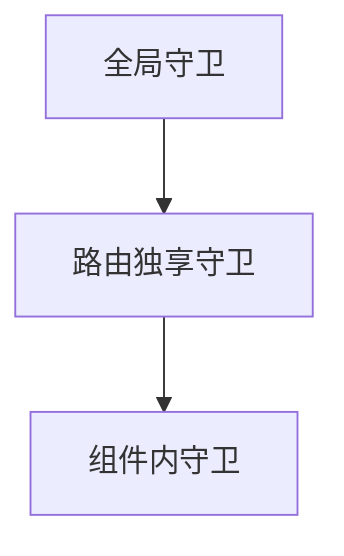
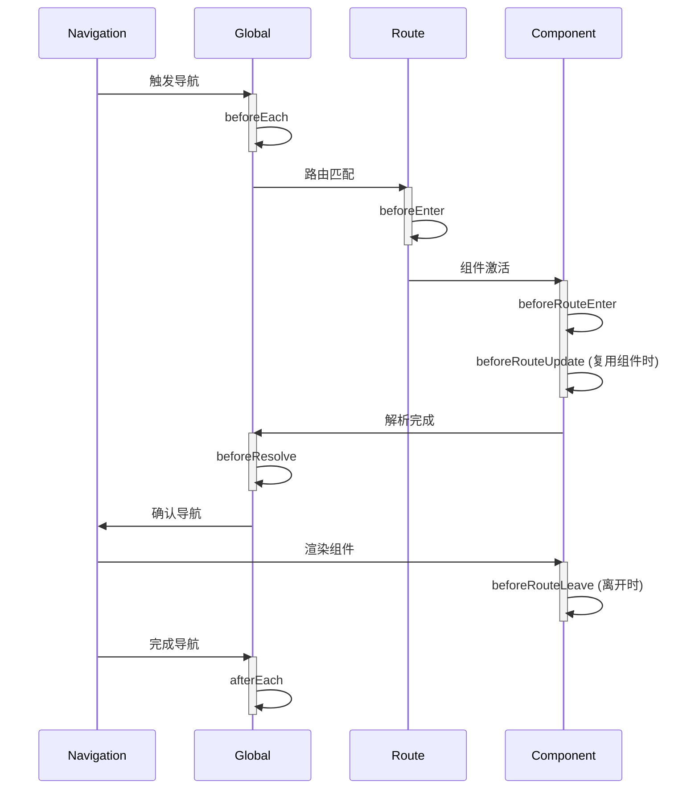

# 一、什么是前端路由

在传统的多页面应用中，每次页面跳转都需要向服务器请求新的页面资源，造成页面闪烁和加载延迟。而**单页面应用(SPA)** 通过前端路由实现了**无刷新页面切换**的体验。

一个路由（route）就是一组映射关系（key - value），多个路由需要路由器（router）进行管理。

前端路由：key是路径，value是组件。


# 二、基本使用

1. 安装vue-router，命令：`npm i vue-router`

2. 应用插件：`Vue.use(VueRouter)`

3. 基础配置，在`src/router/index.js`中配置路由：

   ``` js
   import Vue from 'vue'
   import VueRouter from 'vue-router'
   import Home from '../views/Home.vue'
   import About from '../views/About.vue'
   
   Vue.use(VueRouter)
   
   const routes = [
     {
       path: '/',          // URL 路径
       name: 'Home',       // 路由名称（可选）
       component: Home     // 对应的组件
     },
     {
       path: '/about',
       name: 'About',
       component: About
     }
   ]
   
   const router = new VueRouter({
     mode: 'history',     // 路由模式：history 或 hash
     base: process.env.BASE_URL,
     routes
   })
   
   export default router
   ```

4. 挂载路由到Vue实例

   在`main.js`中：

   ``` js
   import Vue from 'vue'
   import App from './App.vue'
   import router from './router'  // 导入路由配置
   
   new Vue({
     router,  // 挂载路由
     render: h => h(App)
   }).$mount('#app')
   ```

# 三、核心组件与路由导航

## 1. 路由出口：`<router-view>`

在 App.vue 中放置路由视图容器：

```js
<template>
  <div id="app">
    <div class="navigation">
      <!-- 导航链接 -->
    </div>
    <router-view/>  <!-- 路由匹配的组件将在此处渲染 -->
  </div>
</template>
```

---


`<router-view>` 是 Vue Router 提供的一个**动态组件容器**，它的核心功能是根据当前 URL 路径渲染匹配的组件。你可以把它想象成一个智能的"占位符"：

```js
<!-- 在 App.vue 中 -->
<template>
  <div id="app">
    <header>网站标题</header>
    
    <!-- 主要内容区域 - 路由视图容器 -->
    <router-view></router-view>
    
    <footer>版权信息</footer>
  </div>
</template>
```

Vue Router 的 `<router-view>` 本质上是一个**渲染函数**，它会：

1. 获取当前路由匹配的组件
2. 创建组件实例
3. 将组件渲染到当前位置


## 2. 路由链接：`<router-view>`

替代传统的 `<a>` 标签，实现无刷新导航：

``` html
<router-link to="/">首页</router-link>
<router-link to="/about">关于我们</router-link>

<!-- 带参数的动态链接 -->
<router-link :to="{ name: 'user', params: { id: 123 }}">用户详情</router-link>
```


## 3. 编程式导航

在 JavaScript 中控制路由跳转：

``` js
// 基本跳转
this.$router.push('/about')

// 命名路由跳转
this.$router.push({ name: 'About' })

// 带查询参数
this.$router.push({ path: '/search', query: { keyword: 'vue' } })

// 替换当前路由（不添加历史记录）
this.$router.replace('/login')

// 前进/后退
this.$router.go(-1)  // 后退一步
```


# 四、路由进阶技巧

## 1. 多级路由

## 1.1 配置路由规则，使用children配置项：

``` js
routes:[
	{
		path:'/about',
		component:About,
	},
	{
		path:'/home',
		component:Home,
		children:[ //通过children配置子级路由
			{
				path:'news', //此处一定不要写：/news
				component:News
			},
			{
				path:'message',//此处一定不要写：/message
				component:Message
			}
		]
	}
]
```

## 1.2 跳转（要写完整路径）：

``` js
<router-link to="/home/news">News</router-link>
```


## 2. 路由的query参数

## 2.1 传递参数

``` js
<!-- 跳转并携带query参数，to的字符串写法 -->
<router-link :to="/home/message/detail?id=666&title=你好">跳转</router-link>
				
<!-- 跳转并携带query参数，to的对象写法 -->
<router-link 
	:to="{
		path:'/home/message/detail',
		query:{
		   id:666,
            title:'你好'
		}
	}"
>跳转</router-link>
```

## 2.2 接收参数

``` js
$route.query.id
$route.query.title
```


## 3. 路由的parmas参数

### 3.1 配置路由，声明接收params参数

``` js
{
	path:'/home',
	component:Home,
	children:[
		{
			path:'news',
			component:News
		},
		{
			component:Message,
			children:[
				{
					name:'xiangqing',
					path:'detail/:id/:title', //使用占位符声明接收params参数
					component:Detail
				}
			]
		}
	]
}
```

### 3.2 传递参数

``` js
<!-- 跳转并携带params参数，to的字符串写法 -->
<router-link :to="/home/message/detail/666/你好">跳转</router-link>
				
<!-- 跳转并携带params参数，to的对象写法 -->
<router-link 
	:to="{
		name:'xiangqing',
		params:{
		   id:666,
            title:'你好'
		}
	}"
>跳转</router-link>
```

==特别注意：路由携带params参数时，若使用to的对象写法，则不能使用path配置项，必须使用name配置！==

### 3.3 接收参数

``` js
$route.query.id
$route.query.title
```

## 4. 路由的props配置

作用：让路由组件更方便的收到参数

``` js
{
	name:'xiangqing',
	path:'detail/:id',
	component:Detail,

	//第一种写法：props值为对象，该对象中所有的key-value的组合最终都会通过props传给Detail组件
	// props:{a:900}

	//第二种写法：props值为布尔值，布尔值为true，则把路由收到的所有params参数通过props传给Detail组件
	// props:true
	
	//第三种写法：props值为函数，该函数返回的对象中每一组key-value都会通过props传给Detail组件
	props(route){
		return {
			id:route.query.id,
			title:route.query.title
		}
	}
}
```

## 5. 命名路由

作用：可以简化路由的跳转。

### 5.1 给路由命名

``` js
{
	path:'/demo',
	component:Demo,
	children:[
		{
			path:'test',
			component:Test,
			children:[
				{
          name:'hello' //给路由命名
					path:'welcome',
					component:Hello,
				}
			]
		}
	]
}
```


### 5.2 简化跳转

``` js
<!--简化前，需要写完整的路径 -->
<router-link to="/demo/test/welcome">跳转</router-link>

<!--简化后，直接通过名字跳转 -->
<router-link :to="{name:'hello'}">跳转</router-link>

<!--简化写法配合传递参数 -->
<router-link 
	:to="{
		name:'hello',
		query:{
		   id:666,
        title:'你好'
		}
	}"
>跳转</router-link>
```


## 6. `<router-link>`的replace属性

1. 作用：控制路由跳转时操作浏览器历史记录的模式
2. 浏览器的历史记录有两种写入方式：分别为`push`和`replace`，`push`是追加历史记录，`replace`是替换当前记录。路由跳转时候默认为`push`
3. 如何开启`replace`模式：`<router-link replace .......>News</router-link>`


## 7. 缓存路由组件

作用：让不展示的路由组件保持挂载，不被销毁。

具体编码：

```js
<keep-alive include="News"> 
    <router-view></router-view>
</keep-alive>
```


# 五、路由生命周期钩子

> 在 Vue 路由中，**生命周期钩子**（也称为**路由守卫**）是控制路由导航的关键机制。它们允许你在路由切换的不同阶段注入自定义逻辑，实现权限控制、数据预加载、页面过渡等复杂功能。

## 1. 路由守卫的分类体系

路由守卫可分为三大类，按执行顺序排列如下：



1. 全局守卫 - 作用于所有路由

2. 路由独享守卫 - 仅作用于特定路由

3. 组件内守卫 - 作用于单个组件

## 2. 全局守卫

在路由实例上直接定义的守卫，影响所有路由导航。

### 2.1 `beforeEach` - 全局前置守卫

**触发时机**：导航开始时
**使用场景**：登录验证、权限检查

```js
router.beforeEach((to, from, next) => {
  // to: 即将进入的目标路由
  // from: 当前导航正要离开的路由
  
  if (to.meta.requiresAuth && !isAuthenticated()) {
    next('/login') // 重定向到登录页
  } else {
    next() // 继续导航
  }
})
```

### 2.2 `beforeResolve` - 全局解析守卫 

**触发时机**：导航被确认前，组件内守卫和异步组件解析后
**使用场景**：获取数据前的最后验证

```js
router.beforeResolve((to, from, next) => {
  // 确保用户有权限访问动态加载的组件
  if (to.meta.requiresSpecialAccess) {
    validateSpecialAccess().then(valid => {
      valid ? next() : next('/access-denied')
    })
  } else {
    next()
  }
})
```

### 2.3 `afterEach` - 全局后置钩子

**触发时机**：导航完成后
**使用场景**：页面分析、滚动复位

```js
router.afterEach((to, from) => {
  // 发送页面访问统计
  analytics.trackPageView(to.path)
  
  // 滚动到页面顶部
  window.scrollTo(0, 0)
})
```

## 3. 路由独享守卫

在路由配置中直接定义的守卫，只作用于当前路由。

`beforeEnter`

**触发时机**：进入特定路由前
**使用场景**：路由级别权限验证

```js
const routes = [
  {
    path: '/admin',
    component: AdminPanel,
    beforeEnter: (to, from, next) => {
      if (user.role !== 'admin') {
        next('/403') // 无权限页面
      } else {
        next()
      }
    }
  }
]
```

## 4. 组件内守卫

在组件内部定义的路由守卫，提供更细粒度的控制。

### 4.1 `beforeRouteEnter` - 进入组件前

**触发时机**：路由进入组件前
**特点**：**无法访问组件实例** (`this` 为 undefined)

```js
export default {
  beforeRouteEnter(to, from, next) {
    // 在渲染该组件的对应路由被验证前调用
    next(vm => {
      // 通过 `vm` 访问组件实例
      vm.fetchData(to.params.id)
    })
  }
}
```

### 4.2 `beforeRouteUpdate` - 路由更新时

**触发时机**：路由改变但组件被复用时
**使用场景**：响应路由参数变化

```js
export default {
  beforeRouteUpdate(to, from, next) {
    // 当路由参数变化但组件被复用时
    this.userId = to.params.id
    this.fetchUserData()
    next()
  }
}
```

### 4.3 `beforeRouteLeave` - 离开组件前

**触发时机**：离开当前路由前
**使用场景**：防止用户丢失未保存数据

```js
export default {
  beforeRouteLeave(to, from, next) {
    if (this.unsavedChanges) {
      const confirmLeave = confirm('您有未保存的更改，确定离开吗？')
      confirmLeave ? next() : next(false)
    } else {
      next()
    }
  }
}
```

## 5. 完整导航解析流程



## 6. 路由守卫与组件生命周期的关系

当路由导航发生时，相关组件的生命周期也会被触发：

| 路由钩子              | 组件生命周期 | 执行顺序                |
| :-------------------- | :----------- | :---------------------- |
| beforeRouteEnter      | 组件尚未创建 | 最先执行                |
|                       | beforeCreate |                         |
|                       | created      |                         |
|                       | beforeMount  |                         |
| beforeRouteEnter 回调 | mounted      | 在mounted之前执行       |
| beforeRouteUpdate     | 组件已存在   | 在数据更新周期前执行    |
| beforeRouteLeave      | 组件销毁前   | 在beforeDestroy之前执行 |

# 六、路由模式

## 1. Hash 模式（默认）

- URL 格式：`http://example.com/#/path`
- 原理：使用 URL 的 hash（`#`后面的部分）模拟完整 URL
- 优点：兼容性好，不需要服务器配置
- 缺点：URL 中有 `#`，不够美观

## 2. History 模式

- URL 格式：`http://example.com/path`
- 原理：使用 HTML5 History API（pushState, replaceState）
- 优点：URL 更美观
- 缺点：需要服务器配置，避免 404 错误
